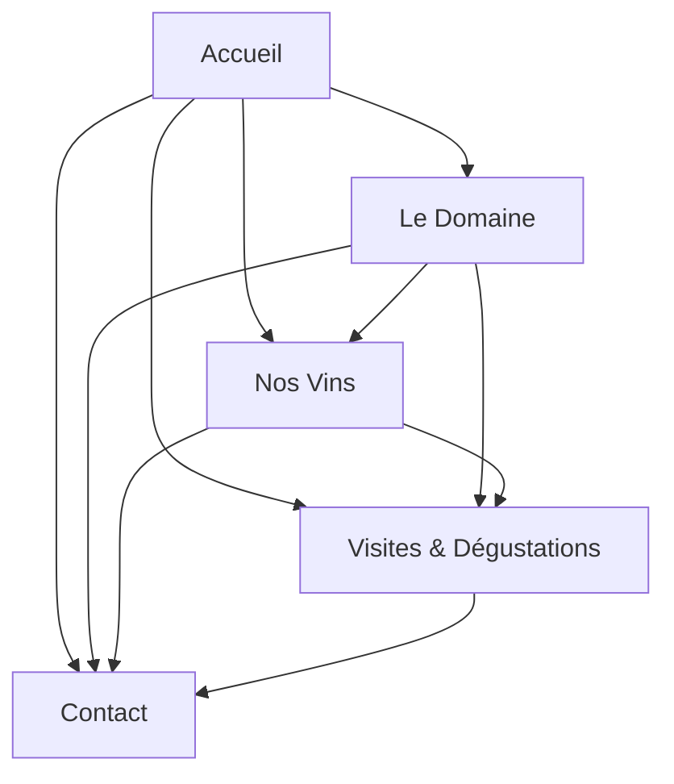

## 1. Product Overview
Site vitrine statique pour le Domaine du Lendemain, un vignoble français présentant ses vins et services. Hébergé sur GitHub Pages, ce site permet de découvrir le domaine, ses vins, et de planifier des visites.

Cible : Amateurs de vin, touristes, clients potentiels du domaine.

## 2. Core Features

### 2.1 User Roles
Pas de système d'authentification requis - site accessible à tous les visiteurs.

### 2.2 Feature Module
Le site vitrine comprend les pages suivantes :
1. **Accueil** : Présentation du domaine, visuel principal, accès rapide aux sections.
2. **Le Domaine** : Histoire, philosophie, terroir et équipe du domaine.
3. **Nos Vins** : Présentation des différents vins, cuvées et caractéristiques.
4. **Visites & Dégustations** : Informations sur les visites, horaires, tarifs et réservation.
5. **Contact** : Coordonnées, formulaire de contact simple, plan d'accès.

### 2.3 Page Details
| Page Name | Module Name | Feature description |
|-----------|-------------|---------------------|
| Accueil | Hero section | Affiche image du vignoble avec titre et slogan accrocheur. |
| Accueil | Navigation | Menu principal avec liens vers toutes les pages. |
| Accueil | Présentation rapide | Texte introductif sur le domaine avec bouton "En savoir plus". |
| Accueil | Vins à la une | Sélection de 3 vins phares avec images et descriptions courtes. |
| Accueil | Call-to-action | Section invitation à visiter le domaine. |
| Le Domaine | Histoire | Présentation chronologique de l'histoire du domaine. |
| Le Domaine | Philosophie | Explication des valeurs et méthodes de production. |
| Le Domaine | Terroir | Description du climat, sol et conditions de culture. |
| Le Domaine | Équipe | Présentation des principaux membres avec photos. |
| Nos Vins | Liste des vins | Grille présentant tous les vins avec images et noms. |
| Nos Vins | Fiche vin détaillée | Pour chaque vin : millésime, cépages, notes de dégustation, prix. |
| Nos Vins | Distinctions | Mentions d'awards ou récompenses reçues. |
| Visites & Dégustations | Types de visites | Description des différentes formules proposées. |
| Visites & Dégustations | Horaires | Calendrier ou horaires d'ouverture saisonniers. |
| Visites & Dégustations | Tarifs | Tableau des prix par type de visite. |
| Visites & Dégustations | Formulaire réservation | Formulaire simple de demande de réservation (sans backend). |
| Contact | Coordonnées | Adresse, téléphone, email du domaine. |
| Contact | Formulaire contact | Champs nom, email, message (envoi via emailto ou service tiers). |
| Contact | Plan d'accès | Carte ou indications pour rejoindre le domaine. |
| Contact | Horaires d'ouverture | Jours et heures d'ouverture au public. |

## 3. Core Process
Le visiteur peut :
1. Arriver sur la page d'accueil et découvrir le domaine
2. Naviguer vers les pages détaillées (Domaine, Vins, Visites)
3. Consulter les informations sur les vins et services
4. Utiliser le formulaire de contact pour demander des informations
5. Accéder aux informations pratiques (horaires, plan d'accès)

## 4. User Interface Design

### 4.1 Design Style
- **Couleurs** : Vert bouteille (#2D5016), Or vieilli (#D4AF37), Blanc cassé (#F5F5DC), Noir pour le texte
- **Boutons** : Style arrondi avec effet hover, couleurs harmonisées avec la charte
- **Typographie** : Police serif élégante pour les titres (Georgia), sans-serif pour le corps (Arial/Helvetica)
- **Layout** : Design épuré avec beaucoup d'espaces blancs, navigation fixe en haut
- **Icons** : Icons minimalistes en style ligne ou solide, couleur or

### 4.2 Page Design Overview
| Page Name | Module Name | UI Elements |
|-----------|-------------|-------------|
| Accueil | Hero section | Image plein écran du vignoble au coucher du soleil, texte superposé en blanc avec ombre portée |
| Navigation | Menu principal | Barre fixe en haut, logo à gauche, menu centré, style transparent avec fond au scroll |
| Le Domaine | Histoire | Mise en page avec timeline verticale, images rondes, textes alternés |
| Nos Vins | Grille vins | Grille responsive 3 colonnes, cards avec image, nom, prix, bouton "Détails" |
| Visites | Tarifs | Tableau élégant avec bordures fines, fond alterné, bouton de réservation |
| Contact | Formulaire | Champs larges avec labels au-dessus, bouton submit or, validation visuelle |

### 4.3 Responsiveness
Design desktop-first avec adaptation mobile. Menu hamburger sur mobile, grille passe à 1 colonne, textes redimensionnés. Optimisation tactile avec boutons suffisamment grands (minimum 44px).

### 4.4 3D Scene Guidance
Non applicable - site vitrine statique sans éléments 3D.