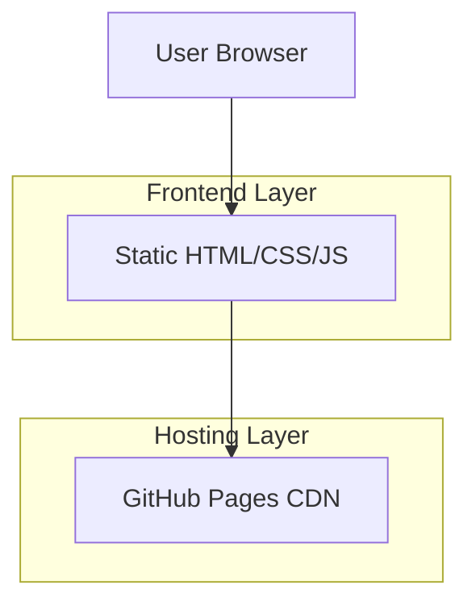

## 1. Architecture design



## 2. Technology Description

* Frontend: HTML5 + CSS3 + JavaScript vanilla

* Build Tool: None (site statique)

* Backend: Aucun

* Hébergement: GitHub Pages

* Dépendances: Aucune (pure HTML/CSS/JS)

## 3. Route definitions

| Route         | Purpose                                                 |
| ------------- | ------------------------------------------------------- |
| /index.html   | Page d'accueil principale                               |
| /domaine.html | Page présentant l'histoire et la philosophie du domaine |
| /vins.html    | Page listant tous les vins du domaine                   |
| /visites.html | Page d'information sur les visites et dégustations      |
| /contact.html | Page de contact avec formulaire                         |

## 4. API definitions

Aucune API nécessaire - site statique sans backend.

Le formulaire de contact utilisera soit :

* Un simple mailto: lien

* Ou un service tiers de formulaires (Formspree, Google Forms, etc.)

## 5. Server architecture diagram

Non applicable - pas de serveur backend.

## 6. Data model

Non applicable - pas de base de données.

## Structure des fichiers recommandée

```
domaine-du-lendemain/
├── index.html
├── domaine.html
├── vins.html
├── visites.html
├── contact.html
├── css/
│   ├── main.css
│   ├── responsive.css
│   └── components.css
├── js/
│   ├── main.js
│   └── contact-form.js
├── images/
│   ├── vignoble/
│   ├── vins/
│   └── equipe/
└── assets/
    ├── fonts/
    └── icons/
```

